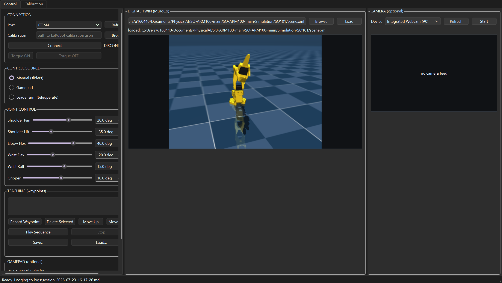

# SO-101 Control Station

A standalone Python GUI for controlling/teleoperating/calibrating a Feetech
STS3215-based SO-ARM100 / SO-101 arm, with a live MuJoCo digital twin,
optional camera feed, optional gamepad input, and a JAKA-style waypoint
teach & playback mode.

Built deliberately **independent of the full LeRobot package** (no PyTorch,
no dataset/training stack) so it stays light enough to hand to anyone on a
bare machine and have it running in a couple of minutes.



*Control tab, read left-to-right: narrow control column (connection, control
source, joint sliders, teaching), Digital Twin as the centerpiece, Camera
feed beside it for comparison. No hardware connected in this shot - the
joint sliders and twin are just posed manually to show the layout.*

## Features

- **Two tabs**: **Control** (jog/teleoperate/teach/monitor) and
  **Calibration** (run a full calibration from scratch, on either arm).
- **Three interchangeable control sources**, selected with a radio button -
  only one drives the arm at a time so inputs never fight each other:
  - **Manual** - the joint sliders.
  - **Gamepad** - standard Xbox-style controller.
  - **Leader arm** - connect a second SO-101 (as leader) and it teleoperates
    the connected arm live, same as `lerobot-teleoperate`, from inside this
    GUI. Leader and follower are calibrated independently, so the relay maps
    "leader fully closed/open" onto "follower fully closed/open" by fraction
    of each arm's own calibrated range, not raw degrees - the two don't need
    to agree on where zero is.
- **Digital twin** - a MuJoCo render of the SO-101 (or SO-101 + Aero Hand, or
  any other MJCF you point it at) that mirrors whatever position is
  currently commanded/measured, live, regardless of which control source is
  active. Runs on its own thread so a slow render never lags the control loop.
- **Camera panel** - any USB webcam via OpenCV (picked by name, not a bare
  index), independent of everything else - handy for comparing the twin's
  motion against the real arm side by side.
- **Teaching tab (waypoints)** - record the follower's current pose (however
  it got there: hand-guided with torque off, driven by the leader, or the
  manual sliders) as a named waypoint, then play the recorded sequence back
  point-to-point. This is scripted playback, not learned behavior - closer to
  an industrial cobot's teach pendant than to imitation learning. Motion
  between waypoints is speed-capped and interpolated (`PLAYBACK_DEG_PER_S` in
  `ui/main_window.py`) instead of jumping straight to each target, and
  sequences can be saved/loaded as `.json`.
- **Full in-GUI calibration** - reproduces `lerobot-calibrate`'s exact
  sequence (reset -> half-turn homing -> record range of motion ->
  wrist_roll left as a full continuous turn -> write limits) with step
  buttons and a live min/pos/max table, for either **Follower** or **Leader**
  role. Clicking **Set middle** first shows a reference image (the digital
  twin's own zero pose, if one's loaded) so a first-time user knows what
  "middle" is supposed to look like before parking the real arm there. Saves
  a calibration `.json` in the same format and, by default, the same folder
  LeRobot's own CLI uses - so files are interchangeable both ways.
- **Hard safety clamp** - every commanded position is clamped to the
  calibrated `range_min`/`range_max` for that joint before it's ever sent to
  a servo. The Control tab refuses to connect without a calibration file - it
  will not move a joint it doesn't know the safe range for.
- **Session logging** - every connect/disconnect/error/control-source-change
  and a throttled position feed get written to a timestamped markdown file
  under `logs/` (gitignored - it's a debugging aid, not part of the repo).

## Requirements

- Python 3.10+
- A LeRobot-format calibration file per arm (produce one either with
  `lerobot-calibrate`, or with this app's own **Calibration** tab - see below).

## Install

```bash
python -m venv venv
# Windows: venv\Scripts\activate   |   macOS/Linux: source venv/bin/activate
pip install -r requirements.txt
```

## Run

```bash
python main.py
```

### Control tab - jogging one arm

1. **Connection panel**: pick the serial port, browse to that arm's
   calibration `.json`, click **Connect**.
2. **Torque ON** before trying to move it, **Torque OFF** when handling it by hand.
3. **Control Source panel**: leave on **Manual** to drive it with the sliders below.
4. **Digital Twin panel**: browse to an MJCF `scene.xml` and click **Load** - starts mirroring live.
5. **Camera panel**: pick a device index, **Start**. Fully independent of the rest.
6. **Gamepad panel**: plug in a controller, **Enable gamepad**, then select
   **Gamepad** as the control source to actually let it drive the arm.

### Control tab - teleoperating with a leader arm

1. Connect the **follower** as above (Connection panel, top-left) and set its **Torque ON**.
2. In **Control Source**, pick **Leader arm (teleoperate)** - a second
   port/calibration form appears.
3. Fill in the *leader's* port + calibration file, **Connect Leader**. The
   leader's torque is automatically disabled (it's meant to be moved by hand).
4. Move the leader - the follower (and the digital twin) follow live. Switch
   back to **Manual** any time to hand control back to the sliders.

### Control tab - teaching a waypoint sequence

1. Get the follower to a pose you want to record, by whatever means -
   **Torque OFF** and hand-guide it directly (the most JAKA-like way), drive
   it with the leader, or use the manual sliders.
2. Click **Record Waypoint**. Repeat for every point in the sequence -
   **Move Up**/**Move Down** to reorder, **Delete Selected** to drop one.
3. **Play Sequence** - turns torque back on and drives through every
   waypoint in order at a capped, interpolated speed (not a raw jump to each
   target). **Stop** interrupts at any time. Other control sources are
   locked out while a sequence is playing so nothing fights the playback.
4. **Save.../Load...** to keep a sequence as a `.json` file for reuse.

### Calibration tab - from scratch, either arm

1. Pick **Role** (Follower/Leader - only changes the suggested save path/folder).
2. Pick the port, **Connect**.
3. **1. Reset motors** - clears any prior homing/limits, disables torque, sets position mode.
4. Click **2. Set middle** - it first shows a reference pose (a screenshot of
   the loaded digital twin's own zero pose, if any) with a reminder to park
   the real arm there by hand before confirming; only locks it in once you
   click OK.
5. **3. Start recording range of motion**, slowly move every joint (except
   `wrist_roll`, which is a full continuous turn by design) through its
   complete range, watching the live Min/Pos/Max table.
6. **4. Stop recording** once you've covered the full range of every joint.
7. **5. Finish & Save...** - writes the limits to the servos and prompts you
   for where to save the `.json` (defaults to LeRobot's own cache path, so
   `lerobot-teleoperate`/`lerobot-record` can find it too).

## Architecture

```
core/
  servo_bus.py          - Feetech STS3215 register-level driver (feetech-servo-sdk + pyserial only)
  calibration_worker.py  - runs the calibrate sequence step-by-step, in the background
  digital_twin.py         - MuJoCo model/render wrapper (degree- and fraction-based joint setters)
  twin_worker.py            - runs the digital twin's render loop on its own QThread (15fps)
  workers.py                  - QThread workers: robot polling loop, camera capture, gamepad polling
  camera_enum.py                - human-readable camera device names (pygrabber, with a cv2 fallback)
  session_logger.py               - writes a timestamped markdown debug log under logs/
ui/
  main_window.py             - wires everything together, arbitrates control source, owns the
                                 teaching/playback state machine and the calibration guidance dialog
  control_source_panel.py     - Manual / Gamepad / Leader selector + leader connection form
  calibration_panel.py          - Calibration tab: connect, 5 step buttons, live table
  teaching_panel.py                - waypoint list + record/delete/reorder/play/stop/save/load
  joint_panel.py                     - slider rows
  connection_panel.py                  - port/calibration/connect/torque controls (Control tab)
  camera_panel.py                        - camera view + device dropdown
  twin_panel.py                            - digital twin view
  gamepad_panel.py                           - gamepad status/legend
  style.py                                     - dark industrial theme (QSS)
```

All hardware I/O (serial, camera, joystick) runs on background `QThread`s and
only ever talks to the GUI thread through Qt signals - the window never
blocks waiting on a servo or a camera frame.

The register map, sign-magnitude encoding, and calibration algorithm (reset /
half-turn homing / range-of-motion recording / wrist_roll special-case) were
verified directly against LeRobot's own `lerobot/motors/{motors_bus.py,
feetech/{tables.py,feetech.py}}` and `lerobot/robots/so_follower/so_follower.py`
(Apache-2.0) and re-implemented standalone here rather than imported,
specifically to avoid pulling in the full `lerobot` + `torch` dependency chain.

## Known limitations / good next steps

- **Gamepad mapping is fixed** (edit `DEFAULT_AXIS_MAP` /
  `DEFAULT_BUTTON_MAP` in `ui/gamepad_panel.py` to remap) - an on-screen
  mapping editor would be a reasonable v2.
- **One camera at a time** in the UI, though nothing stops running a second
  `CameraPanel` instance if you want a wrist + overhead view side by side.
  Switching between two *different* physical camera devices back-to-back is
  known to be flaky on some Windows/OpenCV combinations - Stop before
  picking a different device rather than swapping directly.
- **Teaching is scripted waypoint playback, not learned behavior** - point-
  to-point positions only, no recorded velocity/force profile, no
  generalization to a changed scene. For imitation-learning-style dataset
  recording, use `lerobot-record` (it'll happily reuse calibration files
  saved here).

## License

MIT (adjust to taste before publishing) - this project intentionally avoids
GPL/heavy dependencies to keep it easy to fold into other people's robot
tooling.
