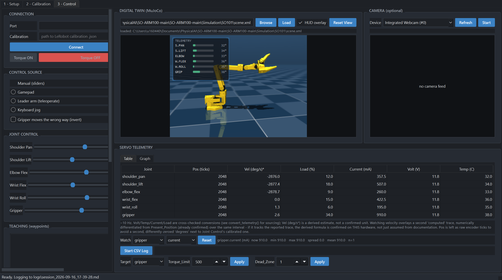

# SO-101 Control Station

[](https://github.com/HaikalBaiqunni/so101-control-station/actions/workflows/ci.yml)
[](LICENSE)
[](https://www.python.org/downloads/)

A standalone Python GUI that takes a Feetech STS3215-based **SO-101 /
SO-ARM100** arm from *"I just opened the box"* to *"it's moving"* — motor id
assignment, calibration, jogging, teleoperation and waypoint teaching, with a
live MuJoCo digital twin and servo telemetry.

**The problem it solves:** getting a new SO-101 running normally means several
terminal tools, a calibration procedure driven by blocking `input()` prompts,
and a full LeRobot + PyTorch install — before the arm has moved once. That is
a lot of yak-shaving between a beginner and their first taste of physical AI.
This app collapses it into three tabs you work through in order, with no
`lerobot` dependency at all.



*Control tab, read left to right: narrow control column (connection, control
source, joint sliders, teaching), Digital Twin as the centrepiece, Camera feed
beside it for comparison. No hardware connected in this shot — the sliders and
twin are posed manually to show the layout.*

---

## Quick start

```bash
git clone https://github.com/HaikalBaiqunni/so101-control-station.git
cd so101-control-station
python -m venv venv
```

```bash
venv\Scripts\activate
```

```bash
source venv/bin/activate
```

```bash
pip install -r requirements.txt
python main.py
```

**New to this? Read [docs/GETTING_STARTED.md](docs/GETTING_STARTED.md).** It
walks the whole path from an unopened kit to a moving arm and explains what
each stage is actually for.

---

## The three tabs, in the order you use them

### 1 · Setup — give each servo an ID

Every STS3215 leaves the factory answering to **id 1**. Six of them on one bus
are electrically fine but logically identical: a read addressed to id 1 gets
six colliding replies. Nothing else works until each has its own address.

- **Bus scan** across all eight Feetech baudrates and ids 0–20 (plus an opt-in
  0–253 deep scan), so a servo someone previously reconfigured still turns up.
- **Arm status checklist** — which of the six joints are present, which are
  missing, which are on the wrong baudrate.
- **Guarded id assignment** — only enabled when the scan sees *exactly one*
  servo, because with several attached they would all take the new id at once.
- **Baudrate repair** for a servo left at something other than 1 Mbps.

This is the in-GUI equivalent of `lerobot-setup-motors`.

### 2 · Calibration — record what "middle" and "as far as it goes" mean

Reproduces `lerobot-calibrate`'s exact sequence (reset → half-turn homing →
record range of motion → `wrist_roll` as a full continuous turn → write
limits) as **five step buttons that unlock in order**, with a live
Min/Pos/Max table and a hint line saying what to do next.

Clicking **Set middle** first shows a reference image — the digital twin's own
zero pose — so a first-timer can see what "middle" is supposed to look like
before parking the real arm there.

Saves a `.json` in LeRobot's format, by default in LeRobot's own folder, so
files are interchangeable **both ways** with `lerobot-teleoperate` /
`lerobot-record`. See [docs/CALIBRATION.md](docs/CALIBRATION.md) for what the
numbers mean.

Works for either **Follower** or **Leader** role.

### 3 · Control — drive it

**Four interchangeable control sources**, radio-selected so only one drives
the arm at a time and inputs never fight:

- **Manual** — joint sliders.
- **Keyboard jog** — hold `Q`/`A`, `W`/`S`, `E`/`D`, `R`/`F`, `T`/`G`, `Y`/`H`;
  on-screen keycaps light up while held, multiple at once. Keys held when the
  window loses focus release automatically, so nothing runs away.
- **Gamepad** — standard Xbox-style controller.
- **Leader arm** — connect a second SO-101 and it teleoperates the first, live,
  same as `lerobot-teleoperate`. The two are calibrated independently, so the
  relay maps by *fraction of each arm's own range* rather than raw degrees —
  "leader fully closed" always means "follower fully closed".

Plus:

- **Digital twin** — a MuJoCo render mirroring the live pose, whichever source
  is driving. Runs on its own thread so a slow render never lags the control
  loop.
- **Camera panel** — any USB webcam via OpenCV, picked by *name* rather than a
  bare index. Handy for comparing the twin against the real arm side by side.
- **Teaching (waypoints)** — record the current pose however it got there
  (hand-guided with torque off, leader-driven, or slider-set), reorder, and
  play the sequence back at a capped, quintic-eased speed. **Record Grip**
  records the gripper at its calibrated limit instead of the contact position,
  so a holding waypoint has real closing force behind it. Sequences save/load
  as `.json`.
- **Servo telemetry** — current, load, velocity, voltage and temperature per
  joint at ~10 Hz, as a table or a live graph, with CSV capture. Includes a
  live cross-check that differentiates `Present_Position` and overlays it on
  the reported `Present_Velocity`, so you can confirm the unit on *your*
  hardware rather than trusting a datasheet.
- **Session logging** — every connect/disconnect/error/mode change plus a
  throttled position feed, to a timestamped markdown file under `logs/`.

---

## Safety

This app is deliberately opinionated about not moving hardware it doesn't
understand:

- The Control tab **refuses to connect without a calibration file**. There is
  no "just let me move it" mode.
- Every commanded position is **clamped to the calibrated range** in raw ticks
  before it reaches a servo — a GUI bug or a wild slider drag cannot exceed it.
- **Torque-on seeds the goal with the current measured pose**, so re-enabling
  torque holds still instead of lurching toward a stale target at the servo
  firmware's own uncontrolled max speed.
- **Id assignment requires exactly one servo on the bus.**
- **Calibration steps are gated in order**, and finishing without a completed
  recording pass is refused rather than writing garbage limits.

---

## Requirements

- Python 3.10+
- An SO-101 / SO-ARM100 with Feetech STS3215 servos, a USB serial adapter, and
  its **5 V power supply** (USB powers the adapter, not the servos — this is
  the single most common "my arm is dead" cause)
- Optional: a MuJoCo MJCF model for the twin, a USB webcam, a gamepad

Installs `PySide6`, `feetech-servo-sdk`, `pyserial`, `opencv-python`, `mujoco`,
`numpy`, `pygame`. **No PyTorch, no `lerobot`.**

---

## Documentation

| Document | For |
|---|---|
| [GETTING_STARTED.md](docs/GETTING_STARTED.md) | Unboxed kit → moving arm, stage by stage |
| [TROUBLESHOOTING.md](docs/TROUBLESHOOTING.md) | Symptom-indexed fixes for everything that commonly goes wrong |
| [CALIBRATION.md](docs/CALIBRATION.md) | What the calibration numbers mean, and LeRobot interop |
| [ARCHITECTURE.md](docs/ARCHITECTURE.md) | Module map, threading model, how to extend it |
| [technical-report.html](docs/technical-report.html) | Narrative engineering write-up with diagrams (EN/JA) |
| [CONTRIBUTING.md](CONTRIBUTING.md) | How to contribute |
| [CHANGELOG.md](CHANGELOG.md) | What changed when |

---

## Relationship to LeRobot

Built deliberately **independent of the full LeRobot package** — no PyTorch, no
dataset/training stack — so it stays light enough to hand to anyone on a bare
machine.

The register map, sign-magnitude encoding and calibration algorithm were
verified directly against LeRobot's own `lerobot/motors/motors_bus.py`,
`lerobot/motors/feetech/{tables.py,feetech.py}` and
`lerobot/robots/so_follower/so_follower.py` (Apache-2.0), then re-implemented
standalone here rather than imported.

Calibration files remain byte-compatible in both directions. Use this app for
setup and calibration, then `lerobot-record` for imitation-learning datasets
if that's where you're headed — it'll happily read the files saved here.

---

## Known limitations

- **Teaching is scripted waypoint playback, not learned behaviour** —
  point-to-point positions only, no recorded velocity/force profile, no
  generalisation to a changed scene. For imitation learning, use
  `lerobot-record`.
- **Gamepad mapping is fixed** (edit `DEFAULT_AXIS_MAP` / `DEFAULT_BUTTON_MAP`
  in `ui/gamepad_panel.py`). An on-screen remapping editor would be a
  reasonable next step.
- **One camera at a time** in the UI. Switching between two *different*
  physical devices back-to-back crashes some Windows/OpenCV combinations, so
  the device picker is locked while a camera runs — Stop, switch, Start.
- **`Present_Velocity`'s unit is a derived estimate**, not vendor-documented.
  The telemetry Graph tab's cross-check exists specifically to let you confirm
  or refute it on your own hardware; it's marked with `*` everywhere it's
  shown.
- **Servo id/baudrate writes are EEPROM writes.** They're bracketed and
  verified, but they are permanent until changed again.

---

## Contributing

Issues and pull requests welcome — see [CONTRIBUTING.md](CONTRIBUTING.md).
Especially valuable: reports from people setting this up for the first time,
since the whole point is that the first hour shouldn't be painful.

## License

[MIT](LICENSE).
