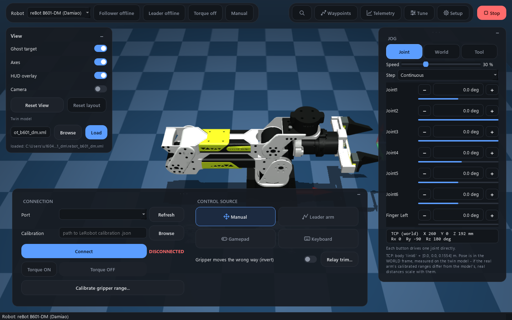
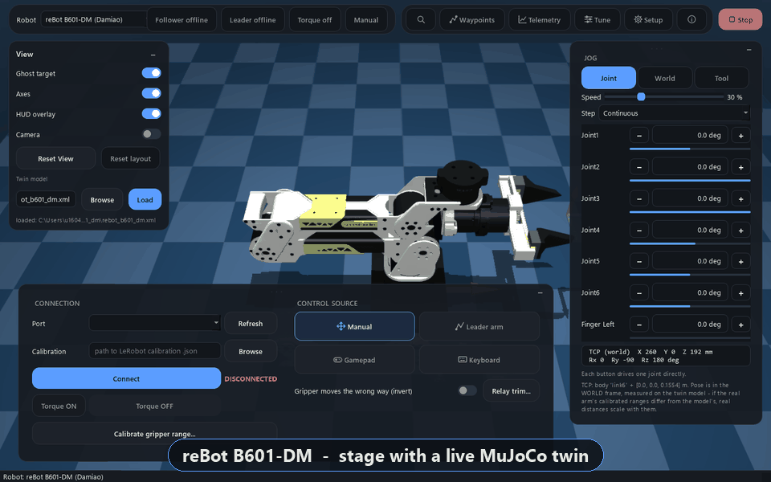
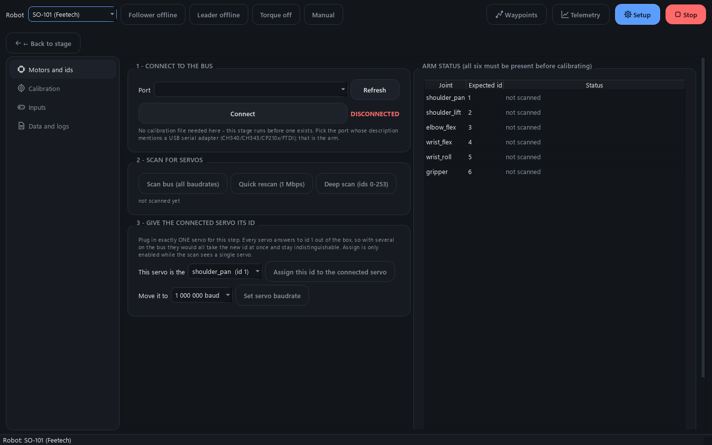
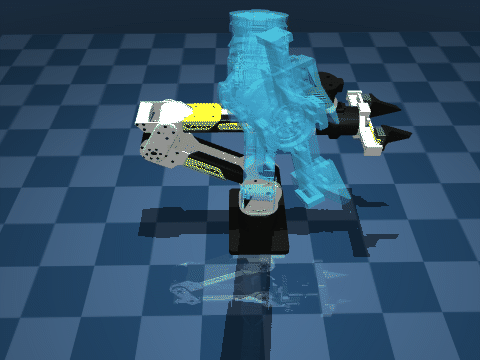

# SO-101 Control Station

[](https://github.com/HaikalBaiqunni/so101-control-station/actions/workflows/ci.yml)
[](LICENSE)
[](https://www.python.org/downloads/)

A standalone Python GUI that takes a Feetech STS3215-based **SO-101 /
SO-ARM100** arm from *"I just opened the box"* to *"it's moving"* — motor id
assignment, calibration, jogging, teleoperation and waypoint teaching, with a
live MuJoCo digital twin and servo telemetry. The same app also drives a second
robot, the **reBot B601-DM** (Damiao CAN motors) with its Seeed Star Arm 102
leader (see [Multi-robot support](#multi-robot-support-rebot-b601-dm-damiao--real-hardware-control)).

**The problem it solves:** getting a new SO-101 running normally means several
terminal tools, a calibration procedure driven by blocking `input()` prompts,
and a full LeRobot + PyTorch install — before the arm has moved once. That is
a lot of yak-shaving between a beginner and their first taste of physical AI.
This app collapses it into one stage plus a Setup hub, with no `lerobot`
dependency at all.



*The stage: the Digital Twin fills the window (rendered at the window's own
resolution, with a live telemetry HUD and a mouse-orbitable camera) and cards
float over it: **View** (Ghost target, Axes, HUD overlay, Camera, Reset View,
model file), **Jog**, and a dock with **Connection** and **Control source**
(Manual / Leader arm / Gamepad / Keyboard). The top bar always shows robot
selection, connection chips and a red **Stop** (follower torque off + back to
Manual). Waypoints, Telemetry and (B601-DM only) Tune open as a drawer;
**Setup** opens the hub. No hardware connected in this shot.*

### Tour: SO-101


*A scripted tour (no hardware connected; the poses and the "online" chips are
simulated to show the layout). The **stage** with the twin following joint motion;
the **leader arm on standby**, with the ghost showing where the follower would
jump and **Engage teleop** locked until the arms are aligned; the **Waypoints** and
**Telemetry** drawers; cards **minimising to tabs**; then the **Setup hub**: bus
scan, guarded id assignment and the five-step calibration wizard.*

### Tour: reBot B601-DM



*Same layout, second robot: it adds the **Tune** drawer (MIT gains, presets,
tracking chart, nudge) and its own Setup hub: CAN-id assignment, and the
follower-gripper and Star Arm 102 leader sweeps under Calibration.*

### What the layout gives you

| | |
|---|---|
| **Top bar** (floats over the stage) | Robot picker, Follower / Leader / Torque / source chips, Search (Ctrl+K), Waypoints, Telemetry, Tune (B601-DM), Setup, About, and a red **Stop** (follower torque off + back to Manual; **Ctrl+Shift+Space**). |
| **Floating cards** | View, Jog, Connection + Control source, Camera. Drag by the handle, **minimise to a tab** with the - button, resize the camera from its corner. Cards never overlap each other or the top bar; with no room left, View / Camera fold into their tab by themselves. Positions are saved; *Reset layout* restores them. |
| **Engage teleop** | Choosing *Leader arm* only puts it on standby. The follower tracks the leader after an explicit **Engage**, allowed when both arms are live, follower torque is on and every arm joint is within a tolerance (default 10 deg). Stop, torque off, a source change or either arm disconnecting ends it. |
| **Tune drawer** (B601-DM) | POS_VEL / MIT mode, per-joint kp/kd with named **presets**, a **tracking chart** (commanded vs measured, peak error / settle / overshoot) and **+/-5 deg nudge** (torque on, Manual only). |
| **Speed slider** | One slider (Jog card) for jog speed and, on the B601-DM, the POS_VEL velocity cap (30 % = 0.3 rad/s, ceiling 0.8 rad/s), so teleop and waypoint playback slow down with it. |
| **Command palette** (Ctrl+K) | Navigation, view toggles, control-source choice and the calibration dialogs. Nothing in it moves an arm. |
| **About** | Creator, version, licence and the tech stack with installed versions. |


**Want every screen walked through with a screenshot, in English or
Japanese?** See the illustrated **[User Manual](https://haikalbaiqunni.github.io/so101-control-station/MANUAL.html)**
(served via GitHub Pages; the source is [docs/MANUAL.html](docs/MANUAL.html) —
that link shows raw HTML on GitHub itself, so use the Pages link above to
actually view it, or open the file locally).

---

## Quick start

```bash
git clone https://github.com/HaikalBaiqunni/so101-control-station.git
cd so101-control-station
python -m venv venv
```

```bash
venv\Scripts\activate
```

```bash
source venv/bin/activate
```

```bash
pip install -r requirements.txt
python main.py
```

**New to this? Read [docs/GETTING_STARTED.md](docs/GETTING_STARTED.md).** It
walks the whole path from an unopened kit to a moving arm and explains what
each stage is actually for.

---

## Setup hub and the stage

The sections below describe each tool. Where they say "tab", read: a section of
the **Setup** hub (Motors and ids, Calibration, Inputs, Data and logs) or a
drawer (Waypoints, Telemetry, Tune).

### 1 · Setup — give each servo an ID



Every STS3215 leaves the factory answering to **id 1**. Six of them on one bus
are electrically fine but logically identical: a read addressed to id 1 gets
six colliding replies. Nothing else works until each has its own address.

- **Bus scan** across all eight Feetech baudrates and ids 0–20 (plus an opt-in
  0–253 deep scan), so a servo someone previously reconfigured still turns up.
- **Arm status checklist** — which of the six joints are present, which are
  missing, which are on the wrong baudrate.
- **Guarded id assignment** — only enabled when the scan sees *exactly one*
  servo, because with several attached they would all take the new id at once.
- **Baudrate repair** for a servo left at something other than 1 Mbps.

This is the in-GUI equivalent of `lerobot-setup-motors`.

### 2 · Calibration — record what "middle" and "as far as it goes" mean

Reproduces `lerobot-calibrate`'s exact sequence (reset → half-turn homing →
record range of motion → `wrist_roll` as a full continuous turn → write
limits) as **five step buttons that unlock in order**, with a live
Min/Pos/Max table and a hint line saying what to do next.

Clicking **Set middle** first shows a reference image — the digital twin's own
zero pose — so a first-timer can see what "middle" is supposed to look like
before parking the real arm there.

Saves a `.json` in LeRobot's format, by default in LeRobot's own folder, so
files are interchangeable **both ways** with `lerobot-teleoperate` /
`lerobot-record`. See [docs/CALIBRATION.md](docs/CALIBRATION.md) for what the
numbers mean.

Works for either **Follower** or **Leader** role.

### 3 · Control — drive it

**Four interchangeable control sources**, radio-selected so only one drives
the arm at a time and inputs never fight:

- **Manual** — the **Jog panel**, JAKA-style (see below).
- **Keyboard jog** — hold `Q`/`A`, `W`/`S`, `E`/`D`, `R`/`F`, `T`/`G`, `Y`/`H`;
  on-screen keycaps light up while held, multiple at once. Keys held when the
  window loses focus release automatically, so nothing runs away.
- **Gamepad** — standard Xbox-style controller.
- **Leader arm** — connect a second SO-101 and it teleoperates the first, live,
  same as `lerobot-teleoperate`. The two are calibrated independently, so the
  relay maps by *fraction of each arm's own range* rather than raw degrees —
  "leader fully closed" always means "follower fully closed".

#### The Jog panel — JAKA-style manual movement

Pick a mode, then **hold a button** to move; let go and it stops.

| Mode | The buttons move… |
|---|---|
| **Joint** | one joint at a time (J1…Jn), with a typed-entry box for an exact angle |
| **World** | the tool centre point along **X / Y / Z** and about **Rx / Ry / Rz**, in directions fixed to the robot base |
| **Tool** | the same six, but in the *gripper's own* frame — it turns with the arm, so **+Z is always "along the approach axis"** |

- **Speed** (defaults to a deliberately slow 30 %) and **Step**: *Continuous*
  moves while the button is held; a number makes each press one fixed move of
  that many degrees (millimetres for X/Y/Z).
- The X/Y/Z/Rx/Ry/Rz readout is the tool's pose **in the world frame**,
  measured on the twin's model, whichever mode is active.
- **Cartesian jogging is built on the twin's own MJCF** (MuJoCo Jacobian,
  damped least squares), so it needs a twin loaded. Without one, World/Tool are
  greyed out and Joint mode still works.
- **A 5-joint arm cannot do every direction.** The SO-101 has five joints that
  place the tool, so at any pose at least one of the six directions is only
  partly reachable (typically pure sideways translation without also turning).
  Those buttons are drawn **dashed** with a tooltip saying how much of the axis is
  available; pressing one still does the best the arm can. The 6-joint reBot has
  no such limit away from singularities.
- Held against a joint limit, the arm slides along the workspace boundary
  instead of stalling; near a singularity the speed is reduced and the panel
  says so.

**Ghost and Axes** (checkboxes above the twin):

- **Ghost** — a translucent copy of the arm at where it is *heading*: the
  waypoint playback is moving to, the target a jog is driving toward while the
  real arm catches up, or whichever waypoint is selected in the list. It is
  hidden whenever it would sit on top of the real arm.
- **Axes** — the **World** triad at the base and the **Tool** triad on the
  gripper tip (red / green / blue = X / Y / Z). The frame the jog buttons act
  in is drawn thick, the other faint, so "which +X is this button?" is answered
  by looking at the arrow it will follow.

> **Cartesian distances are measured on the twin model.** The app maps each
> joint through "fraction of its own calibrated range" onto the model (see
> [docs/CALIBRATION.md](docs/CALIBRATION.md)), so if a real joint's calibrated
> span differs from the model's, real-world distances scale with it. Joint
> jogging is unaffected. Treat the mm readout as the twin's, and check the first
> few Cartesian moves at low speed.

Plus:

- **Digital twin** — a MuJoCo render mirroring the live pose, whichever source
  is driving. Runs on its own thread so a slow render never lags the control
  loop. **Mouse-orbitable**: left-drag to orbit, right-drag (or Shift+left) to
  pan, scroll to zoom, double-click or the Reset View button to return to the
  default pose — the same `mjv_moveCamera` MuJoCo's own viewer uses, so the
  feel matches it. A **telemetry HUD** (load/temperature bars per joint) can
  be painted directly on the render, toggled independently of the Table/Graph
  tabs below.
- **Camera panel** — any USB webcam via OpenCV, picked by *name* rather than a
  bare index. Handy for comparing the twin against the real arm side by side.
- **Teaching (waypoints)** — record the current pose however it got there
  (hand-guided with torque off, leader-driven, or jog-set), reorder, and
  play the sequence back at a capped, quintic-eased speed. **Record Grip**
  records the gripper at its calibrated limit instead of the contact position,
  so a holding waypoint has real closing force behind it. Sequences save/load
  as `.json`.
- **Servo telemetry** — current, load, velocity, voltage and temperature per
  joint at ~10 Hz, as a table or a live graph, with CSV capture. Includes a
  live cross-check that differentiates `Present_Position` and overlays it on
  the reported `Present_Velocity`, so you can confirm the unit on *your*
  hardware rather than trusting a datasheet.
- **Session logging** — every connect/disconnect/error/mode change plus a
  throttled position feed, to a timestamped markdown file under `logs/`.

---

## Multi-robot support: reBot B601-DM (Damiao) — real hardware control

The **Robot** picker in the top bar switches the whole app between
the SO-101 (Feetech) and a second arm, the **reBot B601-DM** (Damiao CAN
motors) — same GUI, same Digital Twin, entirely different hardware
underneath, and (unlike the leader/follower pairing above) genuinely
**two different buses, protocols and vendor toolchains** end to end.



*Switching the Robot selector swaps the Digital Twin's MJCF, rebuilds the
Jog panel for the new joint set, and reconfigures Setup for Damiao's own
CAN-id workflow. This GIF drives the twin through a scripted pose sequence
(not a recording of real hardware; recorded with the earlier tabbed layout) to show the ghost overlay and Cartesian
reach clearly; the same rendering path is what a live B601-DM drives through
on real hardware.*

**Follower — driving the arm:**

- **Setup › Motors and ids** has a dedicated **CAN id assignment** panel for the
  B601-DM's Damiao motors — connect one motor at a time over the same
  USB-serial adapter Damiao's own DM_Tools uses, probe it, give it a unique
  id + master id, saved to flash, then **Verify All** confirms every motor
  answers correctly with the whole arm wired up at once. Every Damiao motor
  ships answering to the same factory default id, so several on one bus
  can't be addressed individually until each has its own — same reasoning
  as the Feetech Setup section, different protocol underneath.
- **The stage** drives the real motors: Connect, Torque on/off (seeded
  with the motor's own current measured position before arming, so
  re-enabling holds still instead of lurching), Joint **and** Cartesian
  (World/Tool) jogging — the same kinematics/jog engine the SO-101 uses,
  working here for free because the Damiao worker exposes the identical
  `request_goal`/`request_torque` interface.
- **Two motion-control modes**, selectable in the **Tune** drawer: **POS_VEL**
  (the safe default — the motor's own onboard position/velocity loop) and
  **MIT** (per-command stiffness/damping, `kp`/`kd`, sent fresh with every
  target — more responsive and inherently compliant, the mode most
  teleoperation setups actually use, at the cost of needing those gains
  tuned live on real hardware rather than trusting a default). MIT gains
  edited while already connected retune the arm **immediately** — no
  disconnect/reconnect, and no torque cycling, needed per tweak.
- **A calibration dialog for the follower's gripper specifically**
  (`Calibrate gripper range…`, Connection panel) — sweeps the real jaw's
  true open/closed travel by hand with torque off, replacing an assumed
  default that (confirmed on real hardware) let a held jog command the
  motor past its actual mechanical stop, stalling it until a fuse blew.
  Torque-off, hand-driven, and refuses to run at all while torque is on.

**Leader — teleoperating it:** the B601-DM's matched leader is Seeed's
**Star Arm 102**, a *completely different* device from the follower — UART
FashionStar smart servos (`motorbridge-smart-servo`), not Damiao CAN at all.
Confirmed directly against real hardware this session (after an earlier,
wrong assumption that it was Damiao-based too):

- Connects over its own USB-serial port, no calibration file needed — its
  zero point lives in the servo's own flash after a one-time
  `set_origin_point()` (equivalent to `lerobot-calibrate`'s own step for
  this leader).
- **`Calibrate leader…`** sweeps every joint's real range by hand — the
  leader's *own* vendor defaults turned out to be wrong for the real unit
  (confirmed by direct measurement: up to ~1.75× off for `wrist_roll`),
  since even LeRobot's own official calibration CLI never actually measures
  this, it just copies its own unverified constants into the calibration
  file.
- Relayed to the follower by *fraction of each arm's own calibrated range*,
  the same reconciliation idea the SO-101 leader/follower pairing already
  used — plus a **gripper-direction invert checkbox** for the one thing a
  swept range can never say on its own (which physical extreme is open vs.
  closed).

---

## Safety

This app is deliberately opinionated about not moving hardware it doesn't
understand:

- Connect **refuses without a calibration file** (SO-101). There is
  no "just let me move it" mode.
- Every commanded position is **clamped to the calibrated range** in raw ticks
  before it reaches a servo — a GUI bug or a wild slider drag cannot exceed it.
- **Torque-on seeds the goal with the current measured pose**, so re-enabling
  torque holds still instead of lurching toward a stale target at the servo
  firmware's own uncontrolled max speed.
- **Id assignment requires exactly one servo on the bus.**
- **Calibration steps are gated in order**, and finishing without a completed
  recording pass is refused rather than writing garbage limits.

---

## Requirements

- Python 3.10+
- An SO-101 / SO-ARM100 with Feetech STS3215 servos, a USB serial adapter, and
  its **5 V power supply** (USB powers the adapter, not the servos — this is
  the single most common "my arm is dead" cause)
- Optional: a USB webcam and a gamepad. The digital twin needs nothing extra: models for
  both robots are bundled under `models/` (the SO-101 one is TheRobotStudio's MJCF,
  Apache-2.0, see `models/so101/NOTICE.md`); use *Browse* in the View card for another model
- For the reBot B601-DM: a USB-to-CAN adapter for the Damiao follower motors,
  and (for teleoperation) Seeed's Star Arm 102 leader over its own
  USB-serial port — both need the WCH **CH340** driver on Windows if nothing
  else has installed it already.

Installs `PySide6`, `feetech-servo-sdk`, `pyserial`, `motorbridge-smart-servo`,
`opencv-python`, `mujoco`, `numpy`, `pygame`. **No PyTorch, no `lerobot`.**

---

## Documentation

| Document | For |
|---|---|
| [MANUAL.html](https://haikalbaiqunni.github.io/so101-control-station/MANUAL.html) | **Illustrated user manual (EN/日本語 toggle)** — every screen in the app, step by step, with real screenshots. (Served via GitHub Pages; the source is `docs/MANUAL.html`.) |
| [GETTING_STARTED.md](docs/GETTING_STARTED.md) | Unboxed kit → moving arm, stage by stage |
| [TROUBLESHOOTING.md](docs/TROUBLESHOOTING.md) | Symptom-indexed fixes for everything that commonly goes wrong |
| [CALIBRATION.md](docs/CALIBRATION.md) | What the calibration numbers mean, and LeRobot interop |
| [ARCHITECTURE.md](docs/ARCHITECTURE.md) | Module map, threading model, how to extend it |
| [technical-report.html](docs/technical-report.html) | Narrative engineering write-up with diagrams (EN/JA) |
| [CONTRIBUTING.md](CONTRIBUTING.md) | How to contribute |
| [CHANGELOG.md](CHANGELOG.md) | What changed when |

---

## Relationship to LeRobot

Built deliberately **independent of the full LeRobot package** — no PyTorch, no
dataset/training stack — so it stays light enough to hand to anyone on a bare
machine.

The register map, sign-magnitude encoding and calibration algorithm were
verified directly against LeRobot's own `lerobot/motors/motors_bus.py`,
`lerobot/motors/feetech/{tables.py,feetech.py}` and
`lerobot/robots/so_follower/so_follower.py` (Apache-2.0), then re-implemented
standalone here rather than imported.

Calibration files remain byte-compatible in both directions. Use this app for
setup and calibration, then `lerobot-record` for imitation-learning datasets
if that's where you're headed — it'll happily read the files saved here.

---

## Known limitations

- **Teaching is scripted waypoint playback, not learned behaviour** —
  point-to-point positions only, no recorded velocity/force profile, no
  generalisation to a changed scene. For imitation learning, use
  `lerobot-record`.
- **Gamepad mapping is fixed** (edit `DEFAULT_AXIS_MAP` / `DEFAULT_BUTTON_MAP`
  in `ui/gamepad_panel.py`). An on-screen remapping editor would be a
  reasonable next step.
- **One camera at a time** in the UI. Switching between two *different*
  physical devices back-to-back crashes some Windows/OpenCV combinations, so
  the device picker is locked while a camera runs — Stop, switch, Start.
- **`Present_Velocity`'s unit is a derived estimate**, not vendor-documented.
  The telemetry Graph tab's cross-check exists specifically to let you confirm
  or refute it on your own hardware; it's marked with `*` everywhere it's
  shown.
- **Servo id/baudrate writes are EEPROM writes.** They're bracketed and
  verified, but they are permanent until changed again.
- **reBot B601-DM's MIT control mode needs per-arm gain tuning.** Its
  default `kp`/`kd` are deliberately very gentle (won't hold a loaded joint
  against gravity out of the box) rather than guessed aggressive — see
  [Multi-robot support](#multi-robot-support-rebot-b601-dm-damiao--real-hardware-control)
  above.
- **The Damiao motor library (`core/dm_can.py`) has no software
  stall/current protection.** POS_VEL's onboard loop will keep applying
  torque toward a commanded position even if it's mechanically unreachable
  (confirmed directly: this is what blew a follower's fuse before the
  gripper calibration dialog existed) — an external fuse sized to the motor
  is the actual safety net, not this app.
- **Joints 1–3's real motor model (Seeed's "J4340P") has no exact match**
  in `dm_can.py`'s `DM_Motor_Type` table — `DM4340` is used as the closest
  available proxy for MIT-mode torque/velocity scaling, flagged in code as
  unverified against a real datasheet.

---

## Contributing

Issues and pull requests welcome — see [CONTRIBUTING.md](CONTRIBUTING.md).
Especially valuable: reports from people setting this up for the first time,
since the whole point is that the first hour shouldn't be painful.

## About

Created by **Haikal Baiqunni**. Built with Python, PySide6 (Qt 6), MuJoCo, NumPy,
OpenCV, pySerial, the Feetech servo SDK, `motorbridge-smart-servo` (FashionStar
Star Arm 102), a vendored Damiao CAN driver and pygame. The same information,
with the versions installed on your machine, is in the app under the **About**
button (top bar, the "i").

## License

[MIT](LICENSE).
