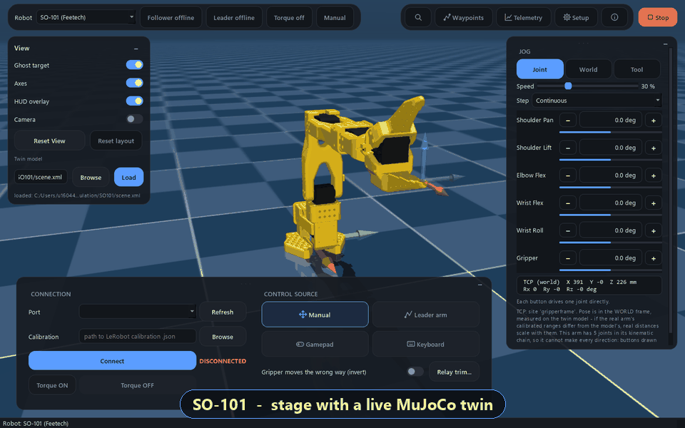

# SO-101 Control Station

[](https://github.com/HaikalBaiqunni/so101-control-station/actions/workflows/ci.yml)
[](LICENSE)
[](https://www.python.org/downloads/)

**One desktop app to set up, calibrate, jog and teleoperate two robot arms, with a live MuJoCo digital twin.**
It takes a Feetech **SO-101 / SO-ARM100** from *"I just opened the box"* to *"it's moving"*, and
drives the Damiao-based **reBot B601-DM** (with Seeed's Star Arm 102 leader) from the same window.
No PyTorch, no `lerobot` install.


*The stage: the digital twin fills the window and cards float over it. No hardware connected in this shot.*

**The problem it solves:** getting a new SO-101 running normally means several terminal tools, a
calibration procedure driven by blocking `input()` prompts, and a full LeRobot + PyTorch install, all
before the arm has moved once. That is a lot of yak-shaving between a beginner and their first taste of
physical AI. This app collapses it into one stage plus a Setup hub.

## Contents

[Tour](#tour) · [Quick start](#quick-start) · [Supported robots](#supported-robots) · [The layout](#the-layout) ·
[Driving a robot](#driving-a-robot) · [The reBot B601-DM](#the-rebot-b601-dm) · [Cameras](#cameras) ·
[Safety](#safety) · [Requirements](#requirements) · [Documentation](#documentation) ·
[Relationship to LeRobot](#relationship-to-lerobot) · [Known limitations](#known-limitations)

---

## Tour

Scripted tours of the layout (no hardware connected; the poses and the "online" chips are simulated).

**SO-101**: the stage with the twin following joint motion, the leader arm on standby with the ghost and
the alignment gate, the Waypoints and Telemetry drawers, cards minimising to tabs, then the Setup hub with
the bus scan, guarded id assignment and the five-step calibration wizard.



**reBot B601-DM**: the same layout, plus the Tune drawer (MIT gains, presets, tracking chart, nudge) and its
own Setup hub with CAN-id assignment and the gripper and leader sweeps.


Want every screen walked through, in English or Japanese? See the illustrated
**[User Manual](https://haikalbaiqunni.github.io/so101-control-station/MANUAL.html)** (served via GitHub
Pages; the source is [docs/MANUAL.html](docs/MANUAL.html), which GitHub only shows as raw HTML).

---

## Quick start

```bash
git clone https://github.com/HaikalBaiqunni/so101-control-station.git
cd so101-control-station
python -m venv venv
```

Activate the environment (Windows, then Linux / macOS):

```bash
venv\Scripts\activate
```

```bash
source venv/bin/activate
```

```bash
pip install -r requirements.txt
python main.py
```

The digital twin loads by itself: models for both robots are bundled. **New to this? Read
[docs/GETTING_STARTED.md](docs/GETTING_STARTED.md)**, which walks the whole path from an unopened kit to a
moving arm and explains what each stage is for.

---

## Supported robots

Pick the robot in the top-left corner; everything else in the app follows.

| | **SO-101 / SO-ARM100** | **reBot B601-DM** |
|---|---|---|
| Motors | Feetech STS3215 on a serial bus | Damiao CAN motors (J4340P base, DM4310 wrist) |
| Leader for teleoperation | A second SO-101 (own port + calibration file) | Seeed Star Arm 102 (FashionStar UART servos, own USB port) |
| Setup | Bus scan, guarded id assignment, baudrate repair | CAN-id probe, assign and *Verify All*, motor state and PID |
| Calibration | Five-step LeRobot-compatible wizard | Read-only sweeps: follower gripper range, leader range |
| Motion control | Position goals | POS_VEL (default) or MIT with live-tunable kp / kd |
| Extras | Torque_Limit / Dead_Zone register writes | Tune drawer, gravity compensation |

The two are genuinely **different buses, protocols and vendor toolchains** end to end; only the GUI, the
twin and the jog engine are shared.

---

## The layout

One window, no tabs: the twin is the background, the tools sit on it as cards, and the heavier ones open as
drawers or in the Setup hub.

| | |
|---|---|
| **Top bar** | Robot picker, Follower / Leader / Torque / source chips, search (**Ctrl+K**), Waypoints, Telemetry, Tune (B601-DM), Setup, About, and a red **Stop** (follower torque off and back to Manual; **Ctrl+Shift+Space**). |
| **Floating cards** | **View** (Ghost target, Axes, HUD overlay, Camera, Reset View, model file), **Jog**, **Connection** + **Control source**, **Camera**. Drag by the handle, minimise to a tab with the **-** button, resize the camera from its corner. Cards never overlap each other or the top bar; if a small window leaves no room, View and Camera fold into their tab by themselves. Positions are saved; *Reset layout* restores them. |
| **Drawers** | **Waypoints**, **Telemetry**, **Tune** open on the right, one at a time. |
| **Setup hub** | **Motors and ids**, **Calibration**, **Inputs**, **Data and logs**, per robot. |
| **Command palette** | **Ctrl+K**: navigation, view toggles, control-source choice and the calibration dialogs. Nothing in it moves an arm. |
| **About** | Creator, version, licence and the tech stack with the versions installed on your machine. |

---

## Driving a robot

### Setting up an SO-101

**Motors and ids: give each servo an id.** Every STS3215 leaves the factory answering to **id 1**. Six of them
on one bus are electrically fine but logically identical, so nothing works until each has its own address.


- **Bus scan** across all eight Feetech baudrates and ids 0-20 (plus an opt-in 0-253 deep scan), so a servo
  someone previously reconfigured still turns up.
- **Arm status checklist**: which joints are present, missing, or on the wrong baudrate.
- **Guarded id assignment**: enabled only when the scan sees *exactly one* servo, because with several attached
  they would all take the new id at once. **Baudrate repair** for a servo left at something other than 1 Mbps.

This is the in-GUI equivalent of `lerobot-setup-motors`.

**Calibration: record what "middle" and "as far as it goes" mean.** Reproduces `lerobot-calibrate`'s exact
sequence (reset, half-turn homing, record range of motion, `wrist_roll` as a full continuous turn, write
limits) as **five step buttons that unlock in order**, with a live Min/Pos/Max table and a hint saying what to
do next. *Set middle* first shows the twin's own zero pose as a reference. It saves a `.json` in LeRobot's format
(by default in LeRobot's own folder), so files are interchangeable **both ways** with `lerobot-teleoperate` and
`lerobot-record`; see [docs/CALIBRATION.md](docs/CALIBRATION.md). It works for either **Follower** or **Leader** role.

### Control sources

Four interchangeable sources, so only one drives the arm at a time and inputs never fight:

- **Manual**: the Jog card (below).
- **Keyboard**: hold `Q`/`A`, `W`/`S`, `E`/`D`, `R`/`F`, `T`/`G`, `Y`/`H`; on-screen keycaps light up while held. Keys
  held when the window loses focus release automatically, so nothing runs away.
- **Gamepad**: a standard Xbox-style controller.
- **Leader arm**: a second arm you move by hand drives the follower, like `lerobot-teleoperate`. The two arms are
  calibrated independently, so the relay maps by *fraction of each arm's own range*, not raw degrees.

**Engage teleop.** Choosing *Leader arm* only puts it on **standby**, and the leader's pose is drawn as the ghost.
The follower tracks the leader after an explicit **Engage**, allowed only when both arms are live, follower torque is
on and every arm joint is within a tolerance (default 10 degrees). Stop, torque off, a source change or either arm
disconnecting ends it. A gripper-invert switch and a per-joint **Relay trim** cover what a swept range can never say
on its own.

### The Jog card

Pick a mode, then **hold a button** to move; let go and it stops.

| Mode | The buttons move... |
|---|---|
| **Joint** | one joint at a time, with a typed-entry box for an exact angle |
| **World** | the tool centre point along **X / Y / Z** and about **Rx / Ry / Rz**, in directions fixed to the robot base |
| **Tool** | the same six in the *gripper's own* frame, so **+Z is always "along the approach axis"** |

- **Speed** (a deliberately slow 30 % by default) is one slider. It scales jog speed and, on the B601-DM, also caps
  how fast the follower chases any target (POS_VEL: 30 % = 0.3 rad/s, never above 0.8 rad/s; MIT: how fast the
  setpoint ramps), so teleop and waypoint playback slow down with it. **Step**: *Continuous*, or one fixed move per press.
- Every joint row has a **range bar** (blue = position inside the calibrated range, cyan tick = the commanded target),
  and Joint mode shows the live **TCP pose** in the world frame.
- **Cartesian jogging is built on the twin's own MJCF** (MuJoCo Jacobian, damped least squares), so World / Tool need
  a twin loaded; Joint mode always works. Held against a joint limit, the arm slides along the workspace boundary
  instead of stalling, and near a singularity the speed is reduced and the panel says so.
- **A 5-joint arm cannot do every direction.** The SO-101 has five joints that place the tool, so at any pose at least
  one of the six directions is only partly reachable. Those buttons are drawn **dashed** with a tooltip; pressing one
  still does the best the arm can. The 6-joint reBot has no such limit away from singularities.

> **Cartesian distances are measured on the twin model.** Each joint is mapped through "fraction of its own
> calibrated range" onto the model (see [docs/CALIBRATION.md](docs/CALIBRATION.md)), so if a real joint's span differs
> from the model's, real-world distances scale with it. Joint jogging is unaffected. Treat the mm readout as the
> twin's, and check the first Cartesian moves at low speed.

### Digital twin, teaching, telemetry

- **Digital twin**: a MuJoCo render mirroring the live pose, on its own thread so a slow render never lags the control
  loop, and rendered at the window's own resolution. **Mouse-orbitable**: left-drag orbits, right-drag (or
  Shift+left) pans, scroll zooms, double-click or *Reset View* returns to the default. Options in the View card:
  - **Ghost target**: a translucent copy of the arm at where it is *heading* (the playing or selected waypoint, a jog
    target, or the leader's pose on standby). Hidden when it would sit on top of the real arm.
  - **Axes**: the **World** triad at the base and the **Tool** triad on the gripper tip; the frame the jog acts in is
    drawn thick.
  - **HUD overlay**: load and temperature bars per joint painted on the render.
- **Waypoints** (drawer): record the current pose however it got there (hand-guided with torque off, leader-driven, or
  jogged), reorder, and play back at a capped, quintic-eased speed. **Record Grip** records the gripper at its
  calibrated limit instead of the contact position, so a holding waypoint has real closing force behind it. Per-waypoint
  delays, loop, and `.json` save / load.
- **Telemetry** (drawer): current, load, velocity, voltage and temperature per joint at about 10 Hz, as a table or a
  live graph, with CSV capture and a live cross-check that differentiates `Present_Position` against the reported
  `Present_Velocity`, so you can confirm the unit on *your* hardware instead of trusting a datasheet.
- **Session log**: every connect, disconnect, error and mode change plus a throttled position feed, to a timestamped
  markdown file under `logs/` (Setup, *Data and logs* opens the folder).

---

## The reBot B601-DM

Switch the Robot picker to **reBot B601-DM**: the app swaps the twin's MJCF, rebuilds the Jog card for the new joint
set and reconfigures Setup for Damiao's CAN-id workflow. The jog engine, twin and everything in the previous section
work the same, because the Damiao worker exposes the identical `request_goal` / `request_torque` interface.

### Follower

- **Setup, Motors and ids**: connect one motor at a time over the same USB-serial adapter Damiao's own DM_Tools uses,
  *Probe* it, give it a unique id and master id (saved to flash), then **Verify All** confirms every motor answers with
  the whole arm wired. Every Damiao motor ships with the same default id, so several on one bus can't be addressed
  until each has its own. No hot-plugging: cut power before touching the XT30 connectors.
- **Torque on / off** seeds each motor with its own measured position before arming, so re-enabling holds still.
- **Gripper range calibration** (*Calibrate gripper range...*, Connection card, or Setup, Calibration): sweep the real
  jaw's open / closed travel by hand with torque off. It replaces an assumed default that once let a held jog drive the
  motor past its real stop until a fuse blew, and refuses to run while torque is on.

### Motion control and the Tune drawer

Two modes, chosen in the **Tune** drawer (the mode applies on the next Connect):

- **POS_VEL** (default): the motor's own position / velocity loop. The safe choice.
- **MIT**: stiffness and damping (`kp`, `kd`) sent with every command. More responsive and compliant, but the gains
  have to be tuned on the real arm. **kp / kd retune the arm live**, with no reconnect and no torque cycling.

Everything for tuning MIT lives in the drawer:

- **Gain presets**: save, load and delete named kp / kd sets. Built in: *Gentle start* (default, safe) and *Holding
  start* (stiffer, a first guess for joints that carry load; **not validated on every arm**, so load it with the arm
  supported and a hand near Stop).
- **Tracking chart**: commanded vs measured position for a chosen joint over the last 10 s, with peak error, settle time
  and overshoot of the latest step. It only reads data.
- **Nudge +/-5 degrees**: enabled only with the follower connected, torque on, Manual control and no teleop or playback.
- **Setpoint ramp**: in MIT the commanded setpoint moves toward a target at the Speed-slider rate (30 % = 90 deg/s)
  instead of jumping, so a far target is approached smoothly. The gripper is exempt.
- **Gravity compensation**: in MIT the motor only receives kp / kd, so a loaded joint sags by about *torque / kp*. This
  sends the arm's own weight, computed from the MuJoCo model, as feed-forward torque instead. It is **off at every
  start** and unlocks only after **Check gravity model** shows the model's holding torques agree in sign and rough size
  with the motors' own torque feedback (a flipped sign convention keeps it locked). It ramps in over a few seconds, is
  capped per joint (12 N*m for joints 1-3, 4 N*m for joints 4-6, none for the gripper), applies only to joints the check
  verified, and switches itself off on Stop, torque off or a disconnect. Tried on a real B601-DM: with it on, the loaded
  joints no longer sag.

### Leader: Star Arm 102

The B601-DM's matched leader is a *completely different* device from the follower: UART FashionStar smart servos
(`motorbridge-smart-servo`), not Damiao CAN.

- It connects over its own USB-serial port and needs **no calibration file**: its zero lives in the servo's own flash
  after a one-time `set_origin_point()` (the equivalent of `lerobot-calibrate`'s step for this leader).
- **Calibrate leader...** sweeps every joint's real range by hand. The vendor defaults turned out to be wrong for the
  real unit (up to about 1.75x off on `wrist_roll`), and LeRobot's own calibration CLI never measures this either.
- It is relayed by *fraction of each arm's own calibrated range*, with the same **Engage teleop** gate, a gripper-invert
  switch for the one thing a swept range can't say (which extreme is open), and **Relay trim**.

---

## Cameras

The **Camera** card shows any camera next to the twin, handy for comparing it with the real arm. Pick the device in the
card and press Start (one camera at a time).

| Camera | How |
|---|---|
| **USB webcam** | Works out of the box through OpenCV, listed by *name* rather than a bare index. |
| **Basler** (USB3 Vision / GigE, e.g. acA1300-200um) | `pip install pypylon` plus the pylon driver. Listed as `Basler <model> (<serial>)`, with auto exposure and gain on. Close pylon Viewer first: the camera can only be opened by one program. |
| **Intel RealSense** (D4xx) | `pip install pyrealsense2`. Listed as `color`, `depth (colormap)` and `color + depth` (depth aligned to the colour image), using the best stream mode the camera can run. A D455 on a USB 2 port streams poorly: use a USB 3 port and cable. |

Both extras are optional (`pip install .[basler]`, `.[realsense]`); without them nothing else changes.

---

## Safety

This app is deliberately opinionated about not moving hardware it doesn't understand:

- **Connect refuses without a calibration file** (SO-101): there is no "just let me move it" mode.
- Every commanded position is **clamped to the calibrated range** before it reaches a motor, so a GUI bug or a wild
  slider drag cannot exceed it.
- **Torque-on seeds the goal with the current measured pose**, so re-enabling torque holds still instead of lurching
  toward a stale target.
- **Stop** (top bar, or Ctrl+Shift+Space) turns follower torque off and returns control to Manual, so a leader that is
  still moving cannot make the arm jump when torque comes back.
- **Teleop needs an explicit, alignment-gated Engage**, and ends by itself on Stop, torque off, a source change or a
  disconnect.
- **Id assignment requires exactly one servo (or motor) on the bus**, and **calibration steps are gated in order**:
  finishing without a completed recording is refused rather than writing garbage limits.
- **Gravity feed-forward is off at every start**, unlocks only after a check against the motors' own torque feedback,
  and is capped per joint.

---

## Requirements

- Python 3.10+
- **SO-101 / SO-ARM100**: Feetech STS3215 servos, a USB serial adapter, and the arm's **5 V power supply** (USB powers the
  adapter, not the servos; this is the single most common "my arm is dead" cause).
- **reBot B601-DM**: a USB-to-CAN adapter for the Damiao follower motors and, for teleoperation, Seeed's Star Arm 102
  leader over its own USB-serial port. Both need the WCH **CH340** driver on Windows if nothing else has installed it.
- Optional: a webcam, a Basler or RealSense camera (see [Cameras](#cameras)), a gamepad.

`requirements.txt` installs `PySide6`, `feetech-servo-sdk`, `pyserial`, `motorbridge-smart-servo`, `opencv-python`,
`mujoco`, `numpy` and `pygame`. **No PyTorch, no `lerobot`.** Digital-twin models for both robots are bundled under
`models/` (the SO-101 one is TheRobotStudio's MJCF, Apache-2.0, see `models/so101/NOTICE.md`); use *Browse* in the View
card for another model.

---

## Documentation

| Document | For |
|---|---|
| [MANUAL.html](https://haikalbaiqunni.github.io/so101-control-station/MANUAL.html) | **Illustrated user manual (EN / 日本語)**: every screen, step by step, with real screenshots. Generated by `tools/make_manual.py`. |
| [GETTING_STARTED.md](docs/GETTING_STARTED.md) | Unboxed kit to moving arm, stage by stage |
| [TROUBLESHOOTING.md](docs/TROUBLESHOOTING.md) | Symptom-indexed fixes for what commonly goes wrong |
| [CALIBRATION.md](docs/CALIBRATION.md) | What the calibration numbers mean, and LeRobot interop |
| [ARCHITECTURE.md](docs/ARCHITECTURE.md) | Module map, threading model, how to extend it |
| [technical-report.html](docs/technical-report.html) | Narrative engineering write-up with diagrams (EN / JA) |
| [CONTRIBUTING.md](CONTRIBUTING.md) | How to contribute |
| [CHANGELOG.md](CHANGELOG.md) | What changed when |

---

## Relationship to LeRobot

Built deliberately **independent of the full LeRobot package** (no PyTorch, no dataset or training stack), so it stays
light enough to hand to anyone on a bare machine.

The register map, sign-magnitude encoding and calibration algorithm were verified against LeRobot's own
`lerobot/motors/motors_bus.py`, `lerobot/motors/feetech/{tables.py,feetech.py}` and
`lerobot/robots/so_follower/so_follower.py` (Apache-2.0), then re-implemented standalone rather than imported.
Calibration files remain byte-compatible in both directions: use this app for setup and calibration, then
`lerobot-record` for imitation-learning datasets if that's where you're headed.

---

## Known limitations

- **Teaching is scripted waypoint playback, not learned behaviour**: point-to-point positions only, no recorded
  velocity or force profile, no generalisation to a changed scene. For imitation learning, use `lerobot-record`.
- **Gamepad mapping is fixed** (edit `DEFAULT_AXIS_MAP` / `DEFAULT_BUTTON_MAP` in `ui/gamepad_panel.py`).
- **One camera at a time.** Switching between two *different* physical devices back-to-back crashes some
  Windows / OpenCV combinations, so the device picker is locked while a camera runs: Stop, switch, Start.
- **`Present_Velocity`'s unit is a derived estimate**, not vendor-documented. The Telemetry graph's cross-check lets you
  confirm or refute it on your hardware; it is marked with `*` everywhere.
- **Servo id and baudrate writes are EEPROM writes.** They are bracketed and verified, but permanent until changed again.
- **B601-DM MIT mode still needs per-arm gain tuning.** The default kp / kd are deliberately very gentle (they won't hold
  a loaded joint against gravity); *Holding start* and gravity compensation exist for that, but both are starting points
  to verify on your arm. The gravity model contains only the arm's own mass, so a payload in the gripper is not
  compensated.
- **The Speed slider's velocity cap applies to the Damiao follower only**; the Feetech follower's teleop speed is not
  affected by it.
- **The Damiao library (`core/dm_can.py`) has no software stall or current protection.** POS_VEL's onboard loop keeps
  applying torque toward an unreachable target (this is what blew a follower's fuse before the gripper calibration
  existed): an external fuse sized to the motor is the real safety net, not this app.
- **Joints 1-3's motor model (Seeed's "J4340P") has no exact match** in `dm_can.py`'s `DM_Motor_Type` table; `DM4340` is
  the closest proxy for MIT torque / velocity scaling, flagged in code as unverified against a datasheet.

---

## Contributing

Issues and pull requests are welcome; see [CONTRIBUTING.md](CONTRIBUTING.md). Reports from people setting this up for the
first time are especially valuable, since the whole point is that the first hour shouldn't be painful.

## About

Created by **Haikal Baiqunni**. Built with Python, PySide6 (Qt 6), MuJoCo, NumPy, OpenCV, pySerial, the Feetech servo SDK,
`motorbridge-smart-servo` (FashionStar Star Arm 102), a vendored Damiao CAN driver and pygame. The same information, with the
versions installed on your machine, is in the app under the **About** button (the "i" in the top bar).

## License

[MIT](LICENSE).
